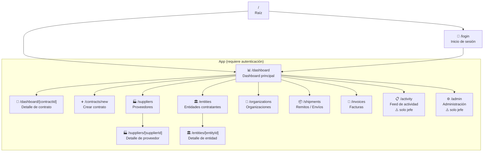

# Mapa de Páginas — LiciTrack

> Abrí la preview con `Cmd+Shift+V`

```mermaid
flowchart TD
    ROOT["/\nRaíz"] --> DASH

    LOGIN["🔐 /login\nInicio de sesión"]

    subgraph APP["App (requiere autenticación)"]
        DASH["📊 /dashboard\nDashboard principal"]
        DASH --> CONTRACT_DETAIL["📄 /dashboard/[contractId]\nDetalle de contrato"]

        DASH --> NEW_CONTRACT["➕ /contracts/new\nCrear contrato"]

        DASH --> SUPPLIERS["🏭 /suppliers\nProveedores"]
        SUPPLIERS --> SUPPLIER_DETAIL["🏭 /suppliers/[supplierId]\nDetalle de proveedor"]

        DASH --> ENTITIES["🏛️ /entities\nEntidades contratantes"]
        ENTITIES --> ENTITY_DETAIL["🏛️ /entities/[entityId]\nDetalle de entidad"]

        DASH --> ORGS["🏢 /organizations\nOrganizaciones"]
        DASH --> SHIPMENTS["📦 /shipments\nRemitos / Envíos"]
        DASH --> INVOICES["🧾 /invoices\nFacturas"]

        DASH --> ACTIVITY["📋 /activity\nFeed de actividad\n⚠️ solo jefe"]
        DASH --> ADMIN["⚙️ /admin\nAdministración\n⚠️ solo jefe"]
    end

    LOGIN --> DASH
    ROOT --> LOGIN
```
